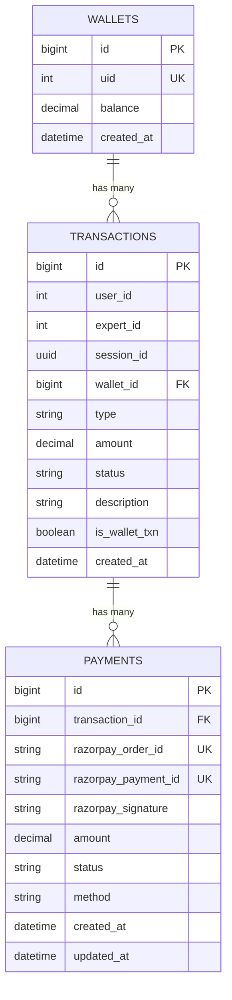

# MEE Transaction Service Database Schema

This document describes the Sequelize models and database relationships used by the Transaction Service.

## Database configuration

- ORM: Sequelize
- Dialect: PostgreSQL
- Connection variable: `DATABASE_URL`
- SQL logging: disabled
- SSL: enabled with `rejectUnauthorized: false`
- Startup synchronization: `sequelize.sync({ alter: true })`
- Default local port: `3001`

The service synchronizes the model definitions before it starts listening. The database connection string may point to a hosted PostgreSQL provider such as Supabase.

## Naming conventions

The models use explicit table names and snake_case column names for most business fields.

All three models use Sequelize timestamps, but they disable the update timestamp where noted:

- `wallets`: `created_at`; no `updated_at`
- `transactions`: `created_at`; no `updated_at`
- `payments`: `created_at` and `updated_at`

---

## Table: `wallets`

Model: `Wallet`

Purpose: Stores one wallet and current balance for each user.

| Column | PostgreSQL/Sequelize type | Null | Default | Notes |
| --- | --- | --- | --- | --- |
| `id` | `BIGINT` | No | Auto-increment | Primary key. |
| `uid` | `INTEGER` | No | None | User ID owned by the CRUD service. Unique at the model level. |
| `balance` | `DECIMAL(12,2)` | No | `0.00` | Current wallet balance in INR. |
| `created_at` | `DATE` | No | Sequelize-managed | Creation timestamp. |

`updated_at` is disabled with `updatedAt: false`.

### Wallet constraints

- `id` is the primary key.
- `uid` has a unique constraint, enforcing one wallet per user.
- `balance` is non-null and defaults to zero.

### Wallet lifecycle

A wallet is created lazily when a balance, top-up, or session payment endpoint first finds no wallet for the authenticated user.

---

## Table: `transactions`

Model: `Transaction`

Purpose: Records wallet credits, session debits, refunds, and payment state.

| Column | PostgreSQL/Sequelize type | Null | Default | Notes |
| --- | --- | --- | --- | --- |
| `id` | `BIGINT` | No | Auto-increment | Primary key. |
| `user_id` | `INTEGER` | No | None | User ID owned by the CRUD service. |
| `expert_id` | `INTEGER` | Yes | None | Optional expert ID owned by the CRUD service. |
| `session_id` | `UUID` | Yes | None | Optional session ID owned by the Session Service. |
| `wallet_id` | `BIGINT` | No | None | Associated wallet ID. |
| `type` | `ENUM('CREDIT','DEBIT','REFUND')` | No | None | Transaction direction/category. |
| `amount` | `DECIMAL(12,2)` | No | None | Amount in INR. |
| `status` | `ENUM('PENDING','SUCCESS','FAILED','REFUNDED')` | No | `PENDING` | Processing state. |
| `description` | `VARCHAR(255)` | Yes | None | Human-readable transaction description. |
| `is_wallet_txn` | `BOOLEAN` | No | `true` | Whether the transaction is fully wallet-funded/internal. |
| `created_at` | `DATE` | No | Sequelize-managed | Creation timestamp. |

`updated_at` is disabled with `updatedAt: false`.

### Transaction type values

| Value | Meaning |
| --- | --- |
| `CREDIT` | Adds funds to a wallet, normally through a Razorpay top-up. |
| `DEBIT` | Charges the user for a session. |
| `REFUND` | Reserved transaction category for refunds. |

### Transaction status values

| Value | Meaning |
| --- | --- |
| `PENDING` | Created but not successfully completed. |
| `SUCCESS` | Successfully completed and visible in transaction history. |
| `FAILED` | Payment verification or processing failed. |
| `REFUNDED` | Reserved state for a refunded transaction. |

### Transaction association

The model declares:

```js
Transaction.belongsTo(Wallet, { foreignKey: 'wallet_id' });
Wallet.hasMany(Transaction, { foreignKey: 'wallet_id' });
```

No explicit `onDelete`, `onUpdate`, or cascade behavior is configured in the association.

---

## Table: `payments`

Model: `Payment`

Purpose: Stores Razorpay order/payment identifiers and the provider-side payment state for a local transaction.

| Column | PostgreSQL/Sequelize type | Null | Default | Notes |
| --- | --- | --- | --- | --- |
| `id` | `BIGINT` | No | Auto-increment | Primary key. |
| `transaction_id` | `BIGINT` | No | None | Associated local transaction ID. |
| `razorpay_order_id` | `VARCHAR(100)` | Yes | None | Unique Razorpay order identifier. |
| `razorpay_payment_id` | `VARCHAR(100)` | Yes | None | Unique Razorpay captured/payment identifier. |
| `razorpay_signature` | `VARCHAR(255)` | Yes | None | Signature received from Razorpay Checkout and used for HMAC verification. |
| `amount` | `DECIMAL(12,2)` | No | None | Provider amount represented in INR, not paise. |
| `status` | `ENUM('CREATED','AUTHORIZED','CAPTURED','FAILED','REFUNDED')` | No | `CREATED` | Payment provider state. |
| `method` | `VARCHAR(50)` | Yes | None | Optional payment method label. |
| `created_at` | `DATE` | No | Sequelize-managed | Creation timestamp. |
| `updated_at` | `DATE` | No | Sequelize-managed | Last update timestamp. |

### Payment status values

| Value | Meaning |
| --- | --- |
| `CREATED` | Local payment row created for a Razorpay order. |
| `AUTHORIZED` | Reserved provider state. |
| `CAPTURED` | Signature verified and payment accepted by this service. |
| `FAILED` | Signature verification or payment processing failed. |
| `REFUNDED` | Reserved provider state for refunds. |

### Payment association

The model declares:

```js
Payment.belongsTo(Transaction, { foreignKey: 'transaction_id' });
Transaction.hasMany(Payment, { foreignKey: 'transaction_id' });
```

No explicit `onDelete`, `onUpdate`, or cascade behavior is configured in the association.

---

## Relationship overview



### Cross-service identity references

These columns refer to records owned by other services and are not locally associated in Sequelize:

- `wallets.uid` refers to a user in the CRUD service.
- `transactions.user_id` refers to a user in the CRUD service.
- `transactions.expert_id` refers to an expert in the CRUD service.
- `transactions.session_id` refers to a session in the Session Service.

The Transaction Service does not locally validate that these external records exist before creating a row.

---

## Payment lifecycle and schema usage

### Wallet top-up

1. `POST /wallet/add-money` creates a `CREDIT` transaction with `PENDING` status.
2. A `payments` row is created with `CREATED` status and the Razorpay order ID.
3. `POST /wallet/verify-payment` verifies the Razorpay signature.
4. On success, the payment becomes `CAPTURED`, the transaction becomes `SUCCESS`, and the wallet balance is increased.
5. On an invalid signature, the matching payment and transaction are marked `FAILED`.

### Session payment requiring Razorpay

1. `POST /wallet/pay-session` creates a `DEBIT` transaction with `PENDING` status.
2. A payment row stores the Razorpay order and the externally payable portion.
3. The client completes Razorpay Checkout.
4. `POST /wallet/verify-session-payment` uses the same verification controller as `/wallet/verify-payment`.
5. On success, the transaction is marked `SUCCESS`, and any wallet-funded portion is deducted.

### Session payment fully covered by wallet

1. No Razorpay order or payment row is created.
2. The wallet balance is reduced immediately.
3. A `DEBIT` transaction is created with `SUCCESS` status and `is_wallet_txn: true`.

---

## Razorpay fields and security notes

- `razorpay_order_id` is unique when present.
- `razorpay_payment_id` is unique when present.
- `razorpay_signature` is stored for verification/audit.
- Razorpay credentials are environment variables and must not be stored in this schema document.
- The backend verifies `razorpay_order_id + '|' + razorpay_payment_id` using HMAC-SHA256 and `RAZORPAY_KEY_SECRET`.
- The frontend and backend represent monetary values in INR; Razorpay order amounts are sent in paise while local model amounts use INR decimals.

## Database synchronization

At startup, the service runs:

```js
sequelize.sync({ alter: true })
```

This can alter existing tables to match the model definitions. The server authenticates to PostgreSQL and synchronizes models before calling `app.listen()`.

## Schema integrity notes

- `Wallet.uid` is the only user-wallet uniqueness constraint declared by the models.
- `Transaction.wallet_id` and `Payment.transaction_id` are association foreign keys at the Sequelize level, but explicit database cascade actions are not configured.
- `razorpay_order_id` and `razorpay_payment_id` are nullable unique columns; PostgreSQL permits multiple null values under a normal unique constraint.
- No explicit indexes beyond primary keys and unique constraints are declared in these model definitions.
- There is no local refund controller or webhook model in this service; `REFUND` and `REFUNDED` values are reserved for future flows.
